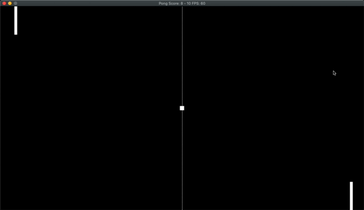

# Pong Game in C++

Final Project for [Udacity C++ Nanodegree Program](https://www.udacity.com/course/c-plus-plus-nanodegree--nd213). I have always liked the game and this is a great opportunity to try and re-create it.

This is a two-player game where the left-hand side player uses the keys `w` and `s`, and the right-hand side player uses the `up` and `down` arrow keys.

There is a small delay before every round to give players time to get ready. In the very first round, the ball will head directly towards the right-hand side player. Every round after that, the direction of the ball heads towards the player who won the last round and at a random angle. 

## Dependencies for Running Locally
* cmake >= 3.7
  * All OSes: [click here for installation instructions](https://cmake.org/install/)
* make >= 4.1 (Linux, Mac), 3.81 (Windows)
  * Linux: make is installed by default on most Linux distros
  * Mac: [install Xcode command line tools to get make](https://developer.apple.com/xcode/features/)
  * Windows: [Click here for installation instructions](http://gnuwin32.sourceforge.net/packages/make.htm)
* SDL2 >= 2.0
  * All installation instructions can be found [here](https://wiki.libsdl.org/Installation)
  * Note that for Linux, an `apt` or `apt-get` installation is preferred to building from source.
* gcc/g++ >= 5.4
  * Linux: gcc / g++ is installed by default on most Linux distros
  * Mac: same deal as make - [install Xcode command line tools](https://developer.apple.com/xcode/features/)
  * Windows: recommend using [MinGW](http://www.mingw.org/)

## Basic Build Instructions

1. Clone this repo.
2. Make a build directory in the top level directory: `mkdir build && cd build`
3. Compile: `cmake .. && make`
4. Run it: `./Pong`.
5. Use `w`, `s`, `up`, and `down` to controller the paddles.
6. Press the `esc` to quit.

## Rubric points

| Rubric point  | Location |
| ------------- | ------------- |
| The project demonstrates an understanding of C++ functions and control structures.  |   All of the files I think!
|s|s|

## References

[https://austinmorlan.com/posts/pong_clone/](https://austinmorlan.com/posts/pong_clone/)
